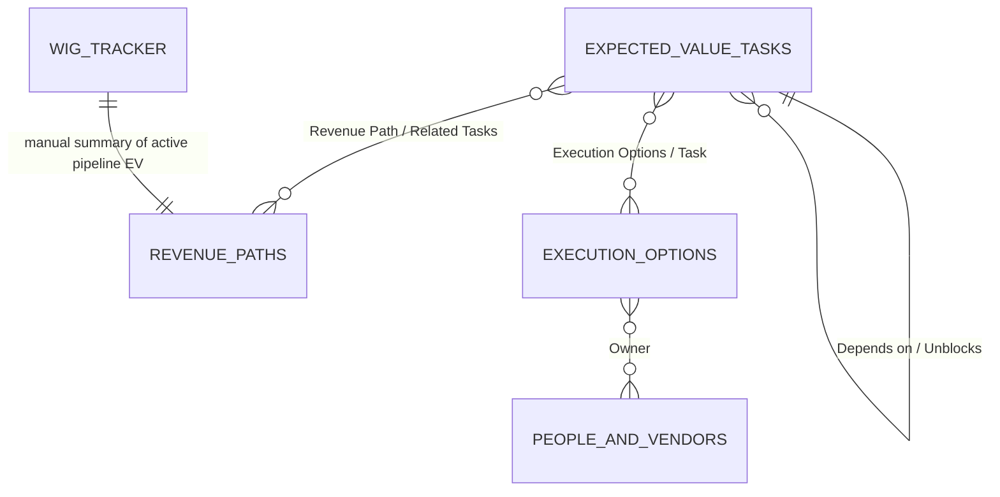

# Expected Value Database

This document explains the expected-value task system used to rank work by dollar-denominated value, probability, time cost, downstream unblock value, required/expiring deadline feasibility, and revenue-path impact.

The MCP personal task engine intentionally keeps `priority` pure: `(P(success) * Value - Cash Cost) / (Hours + Cash Cost / Buyback Rate)`. Deadlines are exposed as metadata and required/expiring deadline guardrails in `getNextAction`; they are not priority multipliers.

The system is centered on the `Expected Value EV Ranked Tasks` database and is supported by related Notion databases for revenue paths, execution options, people/vendors, and weekly WIG tracking.

## Sources

| Source | Role | URL |
|---|---|---|
| Expected Value EV Ranked Tasks | Main task queue and ranking table | https://www.notion.so/76affc223ee1445692faf03661d321d6 |
| Revenue Paths | Revenue opportunities and probability-gated path EV | https://www.notion.so/720d3b9951cb4cd5a9e4026b7eada038 |
| Execution Options | Alternative execution routes for tasks | https://www.notion.so/b396a068af53419fb7858212e90153cd |
| People & Vendors | Reusable actors, vendors, allies, and AI resources | https://www.notion.so/7f82bfad48714910b503695eac282584 |
| WIG Tracker | Weekly annual revenue run-rate tracker | https://www.notion.so/d22c98efad834061ae1aee41423d1b73 |
| Revenue-path architecture note | Design note for Revenue Paths, WIG, and task-priority wiring | https://www.notion.so/34e63f8d1d3b81b58bb6fc2b662f8eb2 |
| Optimization-rate note | Design note for dependency-weighted EV scheduling | https://www.notion.so/34c63f8d1d3b819f84c2efcebb99d84f |

## System Purpose

The EV database is a prioritization system for deciding what to do next. It turns tasks into comparable investment decisions by estimating:

- how much value a task creates if successful
- how likely it is to work
- how many hours it takes
- whether it unlocks other valuable tasks
- whether value arrives soon enough to matter for the current sprint
- whether the task advances an explicit revenue path
- who should do the work and by what execution route

The common unit is dollars. Health, revenue, avoided cost, donated credits, grant proceeds, and operational leverage are normalized into dollar or dollar-equivalent value when they are used for ranking.

## Relationship Map



`WIG Tracker` does not appear to have a direct Notion relation to the other tables. It summarizes the operating system manually: bank balance, fund AUM, grants, salary income, pipeline EV, hours worked, and total ARR.

## Expected Value EV Ranked Tasks

Source: https://www.notion.so/76affc223ee1445692faf03661d321d6

This is the main work queue. Each row is a task with value assumptions, execution estimates, ownership, risk metadata, and ranking formulas.

### Core Fields

| Field | Type | Meaning |
|---|---|---|
| `Task` | Title | Human-readable task name. |
| `Done` | Checkbox | Whether the task is complete. Most ranking views hide completed tasks. |
| `Value` | Number, dollars | Dollar value or dollar-equivalent value if the task succeeds. |
| `P(success)` | Number | Probability from `0` to `1` that the action produces the stated value. |
| `Hours` | Number | Expected time cost. |
| `Hours Low` / `Hours High` | Number | Optional uncertainty range around the time estimate. |
| `Cash Cost` | Number, dollars | Out-of-pocket cost required to execute. |
| `EV Math` | Text | Brief rationale for the value, probability, and hours estimate. |
| `Source URL` | URL | Path or source where the task originated. |
| `Linear` | URL | Linked Linear issue, when present. |

### Routing and Ownership

| Field | Type | Meaning |
|---|---|---|
| `Owner` | Select | Responsible actor: `Mike`, `Claude`, `AI Agent`, `Andreas`, `External`, or `Mike+AI`. |
| `Best Route` | Select | Preferred execution route: `Self`, `AI-assisted`, `Contractor`, `Vendor`, `Ally`, `Automation`, or `Kill`. |
| `Can Delegate` | Checkbox | Whether this task can be delegated. |
| `Execution Options` | Relation | Links to alternate execution approaches in the `Execution Options` database. |
| `Context Fit` | Select | Work context: `Deep Work`, `Quick Win`, or `Admin`. |

### Classification and Risk

| Field | Type | Meaning |
|---|---|---|
| `Pipeline` | Select | Workstream: `IAM Ops`, `Earth Optimization Fund`, `Coalition`, `Structural`, or `Revenue`. |
| `Risk Type` | Select | Main risk class: `Execution`, `External`, or `Trivial`. |
| `Sensitivity` | Select | Sharing sensitivity: `Public`, `Sensitive`, or `Private`. |
| `Exposure risk` | Select | COVID or in-person exposure risk: `None`, `Low`, or `High`. Low or high exposure should trigger explicit consideration before proposing the task. |
| `Deadline` | Date | Hard deadline, when any. |
| `Days to Value` | Number | Estimated days until value materializes. Used for time-horizon discounting. |

### Dependency Graph

| Field | Type | Meaning |
|---|---|---|
| `Depends on` | Self relation | Tasks that must be done first or that make this task easier or more valuable. |
| `Unblocks` | Self relation | Tasks this task enables. |
| `Downstream Value` | Rollup | Sum of `Value` across tasks this task unblocks. |
| `Unfinished blockers` | Rollup | Count of dependencies that are not yet done. A task with zero unfinished blockers is ready to start. |

### Revenue Linkage

| Field | Type | Meaning |
|---|---|---|
| `Revenue Path` | Relation | Links a task to one or more `Revenue Paths`. |
| `Path EV` | Rollup | Sum of `EV` from linked revenue paths. |

### Ranking Formulas

The exact Notion formula source was not available through the connector in this session. The following formulas are confirmed from field descriptions and design notes unless marked as inferred.

| Field | Semantics |
|---|---|
| `EV/hr` | Confirmed by design note: `P(success) * Value / Hours`. |
| `Optimization Rate` | Confirmed by schema description/design note: `EV/hr + (Downstream Value * 0.2 * P(success) / Hours)`. The `0.2` factor models the expected lift from completing a prerequisite. |
| `Time Discount` | Legacy/Notion-style metadata for revenue-path analysis. Personal MCP `priority` does not use time discounts. |
| `Deadline Status` | MCP-derived metadata. `REQUIRED` and `EXPIRES` deadlines can trigger a latest-start guardrail in `getNextAction`, but they do not multiply `priority`. |
| `Real EV/hr` | Inferred from schema/design notes. Uses revenue-path marginal EV where a task is tied to a path. |
| `Task Priority` | Canonical MCP score: expected net value per hour-equivalent of effort/cash. |
| `Uncertainty` | Inferred from schema/design notes. Represents uncertainty from value/hour/probability assumptions. |

### Main Views

| View | Filter | Sort | Purpose |
|---|---|---|---|
| `Default view` | `Done` is false | `EV/hr` descending | Basic open-task EV ranking with EV rationale visible. |
| `By EV/hr` | `Done` is false | `EV/hr` descending | Compact EV-per-hour queue. |
| `Today` | No advanced filters shown | `EV/hr` descending | Short-term working view. |
| `By Boosted EV/hr` | `Done` is false | `Optimization Rate` descending | Prioritizes tasks that also unlock downstream value. |
| `Ready to start` | No filters shown in fetched view config | `Optimization Rate` descending | Intended queue for work that is executable now. |
| `By Task Priority` | `Done` is not true | `Task Priority` descending | Active queue sorted by expected net value per hour-equivalent. |
| `Mike's Queue` | `Done` is not true and `Owner` is `Mike` or `Mike+AI` | `Task Priority` descending | Mike-owned active queue. |
| `Claude's Queue` | `Done` is not true and `Owner` is `Claude` or `AI Agent` | `Task Priority` descending | AI/Claude-owned active queue. |

## Revenue Paths

Source: https://www.notion.so/720d3b9951cb4cd5a9e4026b7eada038

`Revenue Paths` models concrete ways money can arrive. A path can be a grant, deposit, partnership, donation, or salary. Tasks can link to revenue paths so task priority reflects the value of advancing a real pipeline instead of a standalone guess.

### Fields

| Field | Type | Meaning |
|---|---|---|
| `Path Name` | Title | Revenue opportunity name. |
| `Type` | Select | `Grant`, `Deposit`, `Partnership`, `Donation`, or `Salary`. |
| `Status` | Select | `Prospecting`, `Applied`, `In Review`, `Won`, `Lost`, or `Stalled`. |
| `Contact` | Text | Main contact or channel. |
| `Terminal Value Low/Mid/High` | Number, dollars | Range for the eventual value if the path succeeds. |
| `Recurring` | Checkbox | Whether the value is recurring. |
| `ARR Multiplier` | Number | Annual recurring revenue multiplier. |
| `Days to Revenue` | Number | Expected time until revenue arrives. |
| `Notes` | Text | Supporting context. |
| `Related Tasks` | Relation | Tasks that advance this revenue path. |

### Probability Gates

Revenue paths have up to five named gates:

| Gate Fields | Meaning |
|---|---|
| `Gate N Name` | The milestone, decision, or dependency. |
| `Gate N P` | Probability that the gate is passed. |
| `Gate N Status` | `Pending`, `Passed`, `Failed`, or `Bypassed`. |

The revenue-path design note says probabilities should be decomposed into gates instead of stored as a single unsupported compound guess.

### Formulas

Exact Notion formula bodies were not available through the connector. Semantics below are inferred from schema names and the revenue-path architecture note.

| Field | Semantics |
|---|---|
| `Compound P` | Multiplies the active gate probabilities, with unused gates falling back to `1.0`. The design note also mentions a live variant that treats passed gates as `1.0`, failed gates as `0`, and pending gates as their probability estimate. |
| `EV` | Expected value of the path, likely terminal value times compound probability. |
| `Sprint Discount` | Discounts paths by `Days to Revenue` so near-term revenue matters more during a sprint. |
| `Sprint-Adjusted EV` | EV after sprint-timing discount. |
| `ARR Equivalent` | Converts one-time and recurring values into annual revenue run-rate terms. The design note says one-time values are annualized at `1x`, while recurring values are counted at face value. |

## Execution Options

Source: https://www.notion.so/b396a068af53419fb7858212e90153cd

`Execution Options` compares ways to complete a task. It separates the question "what should be done?" from "who or what route should do it?"

| Field | Type | Meaning |
|---|---|---|
| `Option` | Title | Name of the execution option. |
| `Task` | Relation | The task this option belongs to. |
| `Route` | Select | `Self`, `AI-assisted`, `Contractor`, `Vendor`, `Ally`, `Automation`, or `Kill`. |
| `Status` | Select | `Candidate`, `Chosen`, `Rejected`, `In progress`, or `Done`. |
| `Owner` | Relation | Actor from `People & Vendors`. |
| `Route P` | Number | Probability this execution route succeeds. |
| `Task EV Estimate` | Number, dollars | EV estimate used for this option. |
| `Mike Hours` | Number | Mike's time cost. |
| `External Hours` | Number | External actor's time cost. |
| `Calendar Days` | Number | Calendar duration. |
| `Cash Cost` | Number, dollars | Direct cash cost. |
| `Coordination Cost` | Number | Coordination burden. |
| `Quality Risk` | Number | Risk that output quality is insufficient. |
| `Delegation Brief` | Text | Instructions for delegated execution. |
| `Acceptance Criteria` | Text | Conditions for considering the option complete. |

### Formulas

Exact formula bodies were not available through the connector.

| Field | Semantics |
|---|---|
| `Net EV` | Inferred from schema. Expected value after route probability, cash cost, time cost, coordination cost, and/or quality risk. |
| `Mike Leverage Score` | Inferred from schema. Measures how much task value is obtained per unit of Mike time, especially for delegated or AI-assisted routes. |

## People & Vendors

Source: https://www.notion.so/7f82bfad48714910b503695eac282584

`People & Vendors` is the reusable actor table for execution options. It stores who can do work, what they are good at, what they cost, and what trust boundary applies.

| Field | Type | Meaning |
|---|---|---|
| `Name` | Title | Person, vendor, ally, or AI resource name. |
| `Type` | Select | `Mike`, `AI`, `Contractor`, `Vendor`, or `Ally`. |
| `Skills` | Multi-select | Capabilities such as `Grant writing`, `Coding`, `Research`, `Outreach`, `Design`, `Legal`, `Data`, `Admin`, `Strategy`, or `Drafting`. |
| `Hourly Rate` | Number, dollars | Expected hourly cost. |
| `Reliability` | Number | Reliability score. |
| `Trust Level` | Select | `Public-safe`, `Sensitive-safe`, `Private-safe`, or `Unknown`. |
| `Best Use` | Text | Where this actor is most useful. |
| `Contact` | Text | Contact details or channel. |
| `Notes` | Text | Additional context. |

## WIG Tracker

Source: https://www.notion.so/d22c98efad834061ae1aee41423d1b73

`WIG Tracker` tracks the "wildly important goal" of annual revenue run rate. The revenue-path architecture note defines the WIG as:

> Total ARR = IAM grants annualized + fund management fees + salary income.

| Field | Type | Meaning |
|---|---|---|
| `Week` | Title | Weekly tracking label. |
| `Date` | Date | Week date. |
| `IAM Bank Balance` | Number, dollars | Current operating cash. |
| `Fund AUM` | Number, dollars | Fund assets under management. |
| `Grants Received YTD` | Number, dollars | Year-to-date grant receipts. |
| `Salary Income (annual)` | Number, dollars | Annualized salary income. |
| `Pipeline EV (active paths)` | Number, dollars | Manual active pipeline EV snapshot. |
| `Hours Worked` | Number | Weekly time investment. |
| `Notes` | Text | Weekly context. |
| `Annualized Mgmt Fees` | Formula | Inferred formula, likely fund AUM times management-fee rate. The design note references `2% x AUM`. |
| `Total ARR` | Formula | Inferred formula combining grants, management fees, and salary income. |

## Representative Examples

These examples illustrate how the database is used without reproducing the full row set.

### Direct EV Math

A task such as filing the `1% Treaty` trademark application uses direct EV reasoning in `EV Math`: a value estimate, a probability, and an hour estimate produce an EV/hr. The pattern is:

```text
EV/hr = P(success) * Value / Hours
```

For example, a `$30K` value, `0.7` success probability, and `2` hours gives `$10.5K/hr`.

### Revenue-Linked Task

The task `Build decentralized task system (Person + TaskDefinition + TaskAssignment schema, cost-of-delay ticker, auto-reminders)` links to a `Revenue Path`. Its `EV Math` records the estimate:

```text
0.6 * $25K / 10hr = $1.5K/hr
```

The rationale separates implementation probability from value conditional on shipping and notes that the task should wait until higher-priority grant-writing work is done. This shows how `EV Math` can capture not only arithmetic, but sequencing judgment.

### Completed Architecture Task

The task `Build Revenue Paths table + rewire EV calculations to WIG (Annual Revenue Run Rate)` is marked done and uses `EV Math` as an implementation history note. It records that the `Revenue Paths` table, formulas, WIG tracker, task formulas, relation links, and task-priority views were created.

This is a useful pattern for completed system tasks: `EV Math` becomes a compact audit note explaining what changed and why the task was valuable.

## Operating Rules

- Use dollars as the common value unit.
- Do not invent high-value estimates. Terminal values should have a source, citation, or clear rationale.
- Decompose probabilities into gates for revenue paths instead of using a single opaque probability.
- Prefer `Revenue Path` linkage for revenue-producing tasks so values flow from modeled opportunities instead of task-level guesses.
- Treat any EV/hr over `$10K/hr` as requiring a sanity check.
- Keep `EV Math` short but sufficient: value, probability, hours, and why the assumptions are plausible.
- Use `Depends on` and `Unblocks` for real sequencing, not decorative links. `Optimization Rate` depends on this graph being meaningful.
- Respect `Sensitivity` before sharing task content or routing it to an external actor.
- Respect `Exposure risk`. Tasks with `Low` or `High` exposure risk should include explicit consideration before being proposed.
- Mark tasks done instead of deleting them when they are part of the decision history.

## Production Ranking Notes

The Notion database is the prototype ranking surface. The production engine should rank concrete action options, not just task rows: direct execution, AI execution, delegation, outsourcing, funding unblockers, de-risking, decomposition, queue repair, or killing a bad task.

Organizations should be valid actors and assignees. Some optimal actions are not "Mike should do this" or "an AI should do this"; they are "this organization is the efficient executor" or "this user should route through this organization."

Wish Points and future Wish Tokens should be modeled as a parallel coordination and incentive ledger, not the canonical welfare unit. They can reward verified optimization, reputation, UBI experiments, and marketplace participation, but they should not define what is valuable.

Earth Optimization Points can be a useful display unit, derived from USD-equivalent welfare or QALY-equivalent impact. The ranking system should still preserve the underlying health, wealth, probability, time, cost, dependency, and source assumptions so the score remains auditable.

## Connector Limitations

This document is based on read-only Notion inspection through the Codex Notion connector. During inspection:

- database schemas, relation targets, rollups, view definitions, and page properties were available
- representative pages and design notes were available
- SQL querying via the Notion data-source query tool failed in this session
- raw Notion formula-code URLs were not fetchable in this session

For that reason, formulas are marked as confirmed only when they were exposed through schema descriptions or design notes. Formula behavior derived from field names, view sorts, and architecture notes is labeled as inferred from schema/design notes.
